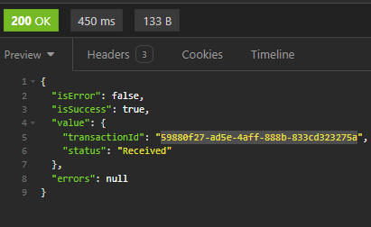
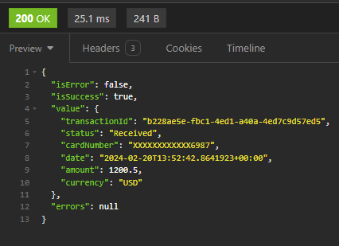

# API GATEWAY

- For this task I choose to use the MediatR lib and vertical slice design pattern that provides loose coupling, single responsability(such as validation, repository and handlers), scalability and testability.
- I'm using in memory cache for develop porpouses, but that could be replaced by any other storage
- Error cases are been treated by the Result wrapper to display error to the client
- I added a shared service to simulate the token generation to comunicate with the Acquiring bank that is hard-coded ATM
- The acquiring bank project was built for tests only and therefore has not any kind of good practices (with more that could be different) :( 

### Assumptions
- User is already autenticated by a layer of security and I'm handling transactions only

### With more time
Things I would improve if I had more time
- Integration tests
- Treat exceptions on validation
- Minimal api
- Different storage

### Documentation
- Swagger

## How to run the application
Both `AcquiringBankSimulator` and `PaymentGateway.Api` should be started

### Create new payment request
```bash
  curl --request POST \
  --url https://localhost:7035/Payments/Process \
  --header 'Content-Type: application/json' \
  --header 'accept: */*' \
  --data '{
   "cardNumber": "1234432178966987",
   "expiryMonth": 10,
   "expiryYear": 2025,
   "amount": 1200.50,
   "currency": "USD",
   "cvv": "123",
   "name": "Bruna Silva"
 }'
```

- TransactionId: Id regerated by the acquiring bank and persisted in app storage 
- Status: Sould be `Received`

### Get payment request info
```bash
  GET https://localhost:7035/Payments/{TransactionId}
```


### Update payment request status
```bash
  curl -X 'POST' \
  'https://localhost:7252/Transactions/Payment/UpdateStatus' \
  -H 'accept: */*' \
  -H 'Content-Type: application/json' \
  -d '"3fa85f64-5717-4562-b3fc-2c963f66afa6"'
```
Returns 200

