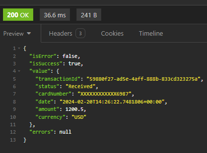

# API GATEWAY

- For this task, I chose to use the MediatR library and the vertical slice design pattern, which provides loose coupling, single responsibility (such as validation, repository, and handlers), scalability, and testability.
- I'm using in-memory cache for development purposes, but that could be replaced by any other storage.
- Error cases are being treated by the Result wrapper to display errors to the client.
- I added a shared service to simulate token generation to communicate with the Acquiring bank that is hard-coded ATM.
- The acquiring bank project was built for tests only and therefore has not any kind of good practices (with more that could be different) :(

### Assumptions
- The user is already authenticated by a layer of security, and I'm handling transactions only.
- The payment process request is asynchronous, and the client will get the callback to display the error or success of that transaction.

### Areas for improvement
Things I would improve if I had more time:
- More unit tests
- Integration tests
- Treat exceptions on validation
- Display the correct StatusCode for the request
- Different storage
- Use of queues to handle the data to be stored in the database

### What cloud technologies you’d use and why
- Database: I would use a SQL database to have relational and typed schema to keep track of transactions and transaction updates (SQL Server).
- Docker + Kubernetes so we could manage the pods to scale only when needed.
- Events to handle the transactions so we could have retry policies and not lose data in case of communication error with the bank and a way to manage the data to be persisted in the DB without holding the request (Suggested design below)


### Documentation
- Swagger

## How to run the application
Both `AcquiringBankSimulator` and `PaymentGateway.Api` should be started.

### Create new payment request
```bash
  curl --request POST \
  --url https://localhost:7035/Payments/Process \
  --header 'Content-Type: application/json' \
  --header 'accept: */*' \
  --data '{
   "cardNumber": "1234432178966987",
   "expiryMonth": 10,
   "expiryYear": 2025,
   "amount": 1200.50,
   "currency": "USD",
   "cvv": "123",
   "name": "Bruna Silva"
 }'
```

- TransactionId: Id regenerated by the acquiring bank and persisted in app storage 
- Status: Should be `Received`

### Get payment request info
```bash
  GET https://localhost:7035/Payments/{TransactionId}
```


### Update payment request status
```bash
  curl -X 'POST' \
  'https://localhost:7252/Transactions/Payment/UpdateStatus' \
  -H 'accept: */*' \
  -H 'Content-Type: application/json' \
  -d '"{TransactionId}"'
```
Returns 200

### To check transaction update
Repeat the steps on `Get payment request info`;

